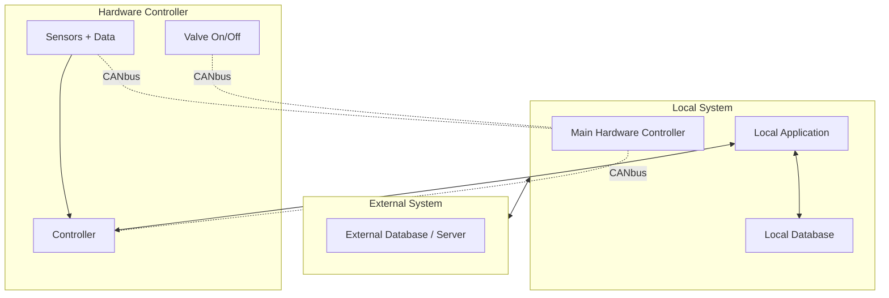

```mermaid
flowchart TD
    subgraph Local_System[Local System]
        app[Local Application]
        db[Local Database]
        mhc[Main Hardware Controller]
    end

    subgraph External_System[External System]
        extdb[External Database / Server]
    end

    subgraph Hardware[Hardware Controller]
        cb[Controller]
        valve[Valve On/Off]
        sensors[Sensors + Data]
    end

    %% Connections
    Local_System <--> External_System
    app <--> db
    app <--> cb
    
    sensors --> cb

    %% Notes
    mhc -. CANbus .- cb
    sensors -. CANbus .- mhc
    valve -. CANbus .- mhc
```
